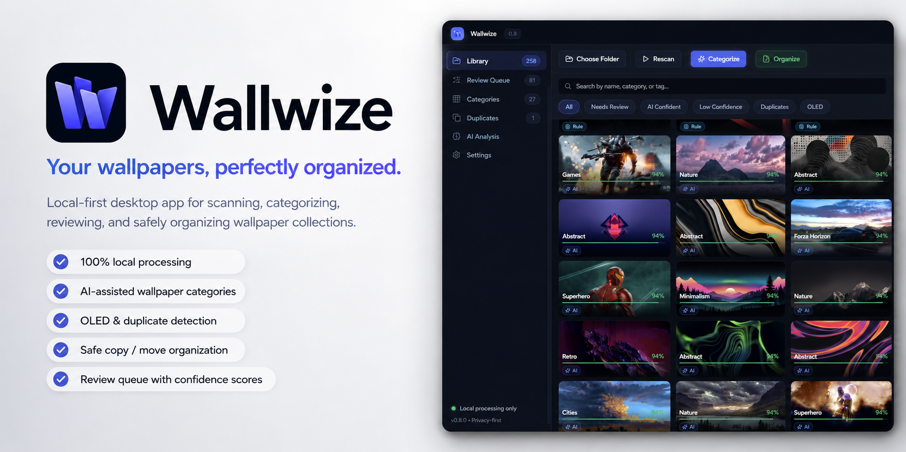

# Wallwize

<p align="center">
  
</p>

<p align="center">
  <a href="https://github.com/xEnakil/Wallwize/actions/workflows/release.yml">
    
  </a>
  
  
  
</p>

<table align="center">
  <tr>
    <td align="center">
      <sub><strong>Project</strong></sub><br>
      <a href="https://github.com/xEnakil/Wallwize/releases/latest">
        
      </a>
      <a href="https://github.com/xEnakil/Wallwize/issues">
        
      </a>
      <a href="#quick-start">
        
      </a>
    </td>
    <td align="center">
      <sub><strong>Support</strong></sub><br>
      <a href="https://ko-fi.com/xenakil">
        
      </a>
      <a href="https://www.paypal.com/paypalme/ElminMughalov">
        
      </a>
    </td>
  </tr>
</table>

Wallwize is a local-first wallpaper organizer for Windows and macOS. I built it for the kind of wallpaper folder that starts as "a few nice images" and slowly turns into a beautiful, impossible-to-browse pile.

It scans your wallpapers, reads useful visual details, suggests categories, catches duplicates, and creates a safe copy or move plan before anything is organized. The desktop app gives you a calm visual library with confidence scores, review queues, category filters, and quick wallpaper actions.

No cloud AI is required. No paid APIs are used. No file is moved unless you ask Wallwize to do it.

## Highlights

- Local-first image analysis - your wallpaper collection stays on your machine.
- AI-assisted categories - optional local CLIP/ONNX vision through Transformers.js.
- OLED detection - finds wallpapers with strong pure-black coverage.
- Duplicate protection - exact duplicate files are skipped during organizing.
- Review queue - low-confidence and uncategorized images stay visible for manual review.
- Safe organization - copy by default, move only when you choose that mode.
- Desktop + CLI - use the polished app, or script scans and plans from the terminal.

## Download

The easiest way to try Wallwize is from the GitHub Releases page.

<p>
  <a href="https://github.com/xEnakil/Wallwize/releases/latest">
    
  </a>
</p>

Release builds include:

- `Wallwize Setup 0.8.0.exe` - normal Windows installer with a Windows uninstaller.
- `Wallwize Portable 0.8.0.exe` - single-file portable app that creates a `Wallwize Portable\Data` folder beside the EXE.
- `Wallwize Folder Portable 0.8.0.zip` - extractable portable folder; app data, thumbnails, and local AI models stay inside the extracted folder.
- `Wallwize 0.8.0-arm64.dmg` - normal drag-to-Applications build for Apple Silicon Macs.
- `Wallwize 0.8.0-x64.dmg` - normal drag-to-Applications build for Intel Macs.

Unsigned macOS test builds are marked `-unsigned`. Signed and notarized builds require the Apple secrets described below.

## Quick Start

1. Download the latest build for your Windows PC or Mac from Releases.
2. Open Wallwize.
3. Click **Choose Folder** and select your wallpaper folder.
4. Click **Categorize** to scan and suggest folders.
5. Check **Review Queue** for anything uncertain.
6. Click **Organize** when you are happy with the plan.

By default, Wallwize copies files into the output folder. Your original collection is kept untouched unless you explicitly switch to move mode.

On macOS, the first **Set wallpaper** action may ask for permission to control System Events. Allow Wallwize under **System Settings → Privacy & Security → Automation**. Wallwize uses that permission only when you explicitly request a desktop wallpaper change.

## What Wallwize Looks For

Wallwize combines simple rules, visual analysis, local discovery, and optional local vision. The current version can detect or calculate:

- Resolution, aspect ratio, file type, file size, and thumbnails.
- Brightness, dark score, pure black percentage, and OLED suitability.
- Dominant colors and simple visual tags.
- Exact duplicates with SHA-256.
- Similar images with perceptual average hashes.
- Known wallpaper genres from filename and folder patterns.
- Repeated local patterns that can become discovered categories.
- Optional local AI vision candidates with confidence scores.

Default category folders include:

```text
OLED/
Anime/
Abstract/
Superhero/
Minimalism/
Nature/
Space/
Games/
Vehicles/
Cities/
Fantasy/
Sci Fi/
Cyberpunk/
Technology/
Retro/
Needs Review/
```

## Privacy And Safety

Wallwize is intentionally careful with files.

- Image analysis runs locally.
- The default vision profile is off.
- Local AI models are optional and cached in Wallwize app data. Portable builds keep that cache inside their portable folder.
- The planner writes a plan before touching files.
- `apply` is a dry run by default in the CLI.
- The desktop app copies files by default.
- Existing files are skipped unless you choose rename behavior.

The goal is simple: help you organize a large wallpaper library without making the app feel scary.

## Local AI Vision

Wallwize can work without AI. In rules-only mode it uses filenames, folder names, OLED signals, color analysis, and discovered local patterns.

If you enable local AI vision, Wallwize uses CLIP/ONNX through Transformers.js to compare wallpapers against category prompts. Larger models may improve accuracy, but they also take more disk space and more time.

Profiles:

```text
off       rules, names, discovery only
small     Xenova/clip-vit-base-patch32, q8
balanced  Xenova/clip-vit-base-patch16, q8
large     Xenova/clip-vit-large-patch14, q8
```

Weak AI suggestions are kept reviewable instead of silently overriding stronger filename or folder evidence.

## Desktop Development

Requirements:

- Python 3.10+
- Node.js 22.12+
- Windows for Windows packaging, or macOS for macOS packaging

Run the app locally:

```powershell
cd UI
npm install
npm run build
npm run desktop
```

For development mode:

```powershell
cd UI
npm install
npm run desktop:dev
```

## CLI Usage

Install the Python package in editable mode:

```powershell
pip install -e .
```

Create sample wallpapers:

```powershell
wallwize sample .\sample_wallpapers
```

Scan a folder:

```powershell
wallwize scan "D:\Wallpapers" -o index.json
```

Create an organization plan:

```powershell
wallwize plan index.json "D:\Wallpapers Sorted" -o plan.json
```

Preview the apply step:

```powershell
wallwize apply plan.json
```

Actually copy files:

```powershell
wallwize apply plan.json --execute
```

Create a move plan only when you really want originals moved:

```powershell
wallwize plan index.json "D:\Wallpapers Sorted" -o plan.json --mode move
```

## Building Release Files

### Windows

From the repository root:

```powershell
.\scripts\build-release.ps1
```

This builds the Python backend executable, the Electron desktop app, installer, portable EXE, folder portable build, and release upload assets.

Installer builds use normal Windows app data and remove Wallwize app data during uninstall. Portable builds keep their runtime data, thumbnails, and local AI model cache inside the portable folder so cleanup is just deleting that folder.

Release assets are written to:

```text
release-bundles/github-release-assets/
```

### macOS

Build the native Python backend and the DMG on the Mac architecture you are targeting:

```bash
python3 -m pip install pyinstaller
python3 -m pip install -e .
python3 -m PyInstaller --noconfirm --distpath build/backend-dist --workpath build/backend-work packaging/wallwize-backend.spec
npm --prefix UI ci
npm run release:mac -- --arm64
```

Use `--x64` instead of `--arm64` on an Intel Mac.

The `Desktop Release` GitHub Actions workflow builds both architectures natively. Add these repository secrets to enable automatic Developer ID signing and Apple notarization:

```text
CSC_LINK
CSC_KEY_PASSWORD
APPLE_API_KEY
APPLE_API_KEY_ID
APPLE_API_ISSUER
```

Without all five secrets, the workflow still creates testable macOS artifacts and labels their filenames `-unsigned`.

## Roadmap

Wallwize 0.8.0 is the first public-friendly release. It already works as a local wallpaper organizer, but the next version is where I want the app to feel much more comfortable for daily use.

Planned for 0.9.0:

- Better manual categorizing UI and smoother bulk category changes.
- Proper duplicate picture review instead of only reporting skipped duplicates.
- Stronger detection and categorization accuracy.
- Clearer review tools for low-confidence AI suggestions.
- More useful category management from inside the desktop app.
- Better explanations for why a wallpaper landed in a category.
- More polished empty states, details panels, and keyboard-friendly flows.

Longer term ideas:

- More advanced duplicate and near-duplicate comparison.
- Saved organization presets.
- Better model download/cache management.
- Optional custom category prompts.
- More visual analytics for large wallpaper libraries.

## Project Structure

```text
src/wallwize/
  analysis/        image metrics, color labels, hashes, thumbnails
  classification/  taxonomy, local discovery, optional local AI vision
  cli/             command line interface
  domain/          shared models and policies
  planning/        copy/move plans, duplicate handling, apply logic
  services/        scanner orchestration
  storage/         JSON persistence

UI/
  app/             React renderer
  electron/        desktop shell, local bridge, Windows and macOS wallpaper actions
  styles/          Wallwize design system and app styling

packaging/         PyInstaller backend packaging
scripts/           release build scripts
tests/             backend regression tests
assets/            icons, README banner, brand assets
```

## Support The Project

If Wallwize saves you time, support is appreciated but never expected.

<p>
  <a href="https://ko-fi.com/xenakil">
    
  </a>
  <a href="https://www.paypal.com/paypalme/ElminMughalov">
    
  </a>
</p>

## Issues And Feedback

Issue reports and careful UI feedback are welcome.

Helpful reports:

- Reproduce a categorization mistake with a clear example.
- Improve wording in the README or app.
- Suggest safer defaults for file organization.
- Share screenshots of confusing UI moments.


## License

Wallwize is source-available. You may read and evaluate the code for personal review, testing, security research, and issue reporting. Forking, redistribution, modified versions, and reuse in other projects require prior written permission. See `LICENSE` for the full terms.
